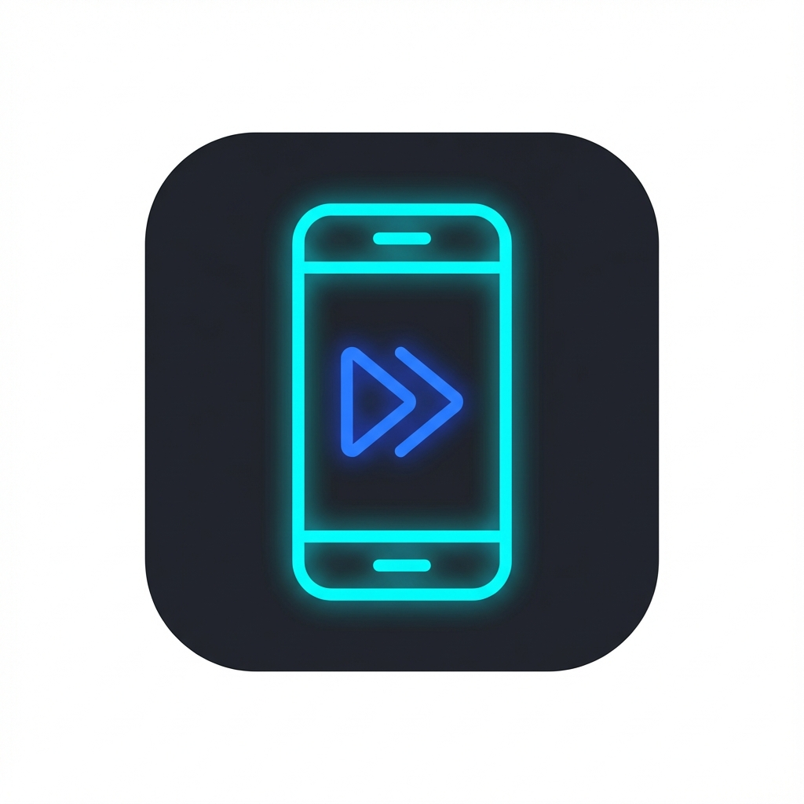

# Project K
### The Ultimate Scrcpy GUI Tool

**Control your Android device from your PC with high performance and low latency.**

[Features](#-features) • [Installation](#-installation) • [Usage](#-usage) • [Shortcuts](#-shortcuts) • [Troubleshooting](#-troubleshooting)

---

## 🚀 Overview

**Project K** is a modern, feature-rich GUI wrapper for [Scrcpy](https://github.com/Genymobile/scrcpy). It simplifies the process of mirroring and controlling your Android device by providing a user-friendly interface for all advanced settings. Whether you are a gamer, a streamer, or a developer, Project K offers the flexibility you need.

## ✨ Features

| Category | Features |
| :--- | :--- |
| **📺 Visuals** | • Support for **H.265** and **AV1** codecs • Resolutions up to **1600p** • Bitrates up to **50 Mbps** • Max FPS up to **120 FPS** (or uncapped) |
| **🎮 Performance** | • **Zero Latency** modes for gaming • **OpenGL** & **Direct3D** rendering options • Configurable buffering (0ms - 400ms) |
| **🔊 Audio** | • Stream audio to PC • Duplicate audio (PC + Phone) • Mute device while mirroring |
| **🛠 Tools** | • **Screen Recording** to MP4 • Turn screen off on launch • Stay Awake mode • Always on Top |
| **🔌 Connectivity** | • Auto-detect connected devices • Wireless support (via TCP/IP setup in ADB) • "Kill ADB" emergency switch |

## � Installation

### Option 1: Standalone Executable (Recommended)
1.  Download the latest release.
2.  Extract the folder.
3.  Run `ProjectK.exe`.
    *   *Note: Ensure `adb.exe` and `scrcpy.exe` are in the same folder (included in the release).*

## 🎮 Usage Guide

### Quick Presets
Don't want to mess with settings? Use the **Quick Presets** in the "Quality" tab:

*   🔴 **YouTube/Stream**: Stable 1080p, 60 FPS, 8 Mbps (Best for consistency).
*   🟢 **Gaming**: 720p, 90 FPS, Low Latency, No Buffer (Best for responsiveness).
*   🟠 **Low End PC**: 480p, 30 FPS, Low Bitrate (Best for older hardware).

### Recording
1.  Go to the **Tools** tab.
2.  Check **"Record Screen to File"**.
3.  Click "Launch".
4.  Choose where to save the `.mp4` file.

## ⌨️ Common Shortcuts (Scrcpy)

| Action | Shortcut (PC) |
| :--- | :--- |
| **Switch Fullscreen** | `Alt` + `f` |
| **Resize to Fit** | `Alt` + `w` |
| **Home Button** | `Alt` + `h` |
| **Back Button** | `Alt` + `b` |
| **App Switcher** | `Alt` + `s` |
| **Turn screen off** | `Alt` + `o` |
| **Volume Up/Down** | `Alt` + `↑` / `Alt` + `↓` |

## ❓ Troubleshooting

*   **No Devices Found?**
    *   Ensure **USB Debugging** is enabled on your phone.
    *   Connect via USB usage data cable (not just charging).
    *   Click "Refresh Devices" in the Dashboard.

*   **Lag or High Latency?**
    *   Try the "Gaming" preset.
    *   Reduce Resolution to 720p or 1080p.
    *   Switch "Video Codec" to H.264 if your PC struggles with H.265.

## 👤 Author

**@piyushkadam96k**

---

  Built with ❤️ using Python & CustomTkinter

